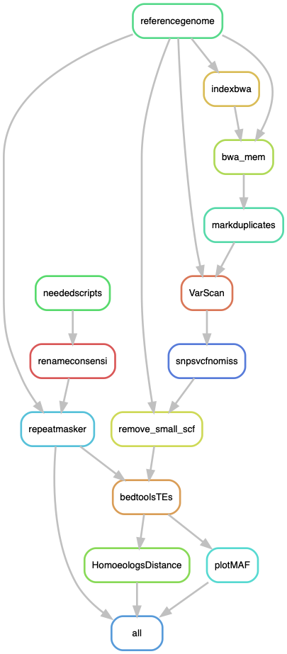

# LichenPloidy: Small pipeline to infer the ploidy of a genome or metagenome
----

This pipeline is designed to calculate the minor allele frequency (MAF) distribution of a given sample based on the read counts of biallelic SNPs. In this case, the objective is to get MAF distributions of all *Letharia* samples using the *L. lupina* pure culture as a reference.

In addition, I also explore the distribution of alleles along the contigs and I try to estimate a rough distance with the other lineages. That estimation was done for the [preprint](https://www.biorxiv.org/content/10.1101/2020.12.18.423428v1) but I decided to remove it for the final publication in favor of another strategy. I keep it here for documentation.

The pipeline relies on the following scripts:

- PloidyMAF_Letharia.R
- HomoeologsDistance.R

The input data is:

- A reference genome: the SPAdes assembly of the pure culture *L. lupina*
- A small gff containing the annotation of the MAT region in the reference genome
- The RepeatLibrary produced in [McKenzie et al. (2020) Genomics](https://www.sciencedirect.com/science/article/pii/S0888754320304614), kindly provided by Sean McKenzie.
- The Illumina reads of each sample in the configuration file. For the paper, these are available in [NCBI’s Short Read Archive](https://www.ncbi.nlm.nih.gov/sra) under the bioprojects PRJNA523679 and PRJNA473595.

## Building the environment

First, you can start by updating conda.

    $ conda update -n base conda

Now, to create the environment.

    $ conda create -n Variants -c bioconda snakemake-minimal=5.19.2 picard=2.23.0 bwa=0.7.17 samtools=1.10 

Activate the environment and install more things

    $ conda activate Variants

    $ conda install bcftools=1.10.2
    $ conda install vcftools=0.1.16
    $ conda install -c bioconda biopython=1.76
    $ conda install varscan=2.4.4
    $ conda install -c bioconda repeatmasker=4.0.8
    $ conda install -c bioconda bedtools=2.29.2
    $ conda install -c bioconda htslib=1.10.2

To plot in R I use independent little environments to avoid any conflicts

    $ cat envs/plotmaf.yaml
```yaml
channels:
  - bioconda
  - defaults
  - conda-forge
dependencies:
  - r-vcfr=1.10.0
  - r-cowplot=1.0.0 # it comes with ggplot2 3.1.1
  - r-tidyr=0.8.3 # included dplyr (the newer version creates conflicts)
  - r-vegan=2.5_6 # Maybe this is not needed
```

## The configuration file

This pipeline uses a configuration file in yaml format. In there, the paths to the data are specified, along with the names of the samples and the minimum size of the contigs used to calculate the MAF distributions.

It looks like so:

```yaml
# Illumina reads path:
Illumina: "data"

# The reference genome
reference: "path/to/L.lupinapure.scaffolds.fasta"

# Annotation file of the scaffold containing the MAT idiomorph
gffmat: "data/MAT_lupina.sorted_Slice_46010_0.gff"

# List of samples to analyze
samples: ["L.columbiana", "L.lupina", "L.lupinapure_postQC", "L.rugosa", "L.vulpina"]
refsampleid: "lupinapure" # name for the reference genome 

# Repeats library from RepeatModeler
TElibrary: "path/to/lelup-families.fa" # Kindly provided by Sean McKenzie
TElibraryid: "lelup-families" # A name for the modified repeat library  

# Minimum size of a scaffold to be retained for the Minor Allele Frequency distribution
minlen: 100000 # In base pairs

PloidyMAF: "scripts/PloidyMAF_Letharia.R"
HomoeologsDistance: "scripts/HomoeologsDistance.R"

```

## Run pipeline in Uppmax (the slurm server of Uppsala University)

First, to get an idea of how the pipeline looks like we can make a rulegraph:

In Mac, you need to install graphviz to run the following command. For that you can do `brew install graphviz` using Homebrew, for example. It otherwise works well in Ubuntu.

    $ snakemake --snakefile LichenPloidy.smk --configfile LichenPloidy_config.yaml --rulegraph | dot -Tpng > rulegraph.png



See if everything is ready to be ran:
    
    $ conda activate Variants
    $ snakemake --snakefile LichenPloidy.smk --configfile LichenPloidy_config.yaml -pn

Run the pipeline:

    $ screen -R LichenPloidy
    $ conda activate Variants
    $ snakemake --snakefile LichenPloidy.smk --configfile LichenPloidy_config.yaml -p --cluster "sbatch -A snicXXXX-X-XXX -p core -n {params.threads} -t {params.time} --mail-user xxxxx@xxxxxxx.xxx --mail-type=ALL" -j 10 --keep-going --use-conda &> LichenPloidy_snakemake.log &

Where `snicXXXX-X-XXX` is your Uppmax project. Change also your email.

## Results

The pipeline should produce a folder called `results` that contains the following:

- A processed version of the input RepeatModeler library to have nicer names
- A plot of coverage distribution on the filtered SNPs (before coverage filtering). This is just for me to see the main patterns.
- Allele frequencies of the *L. lupina* metagenome along the scaffold containing the MAT idiomorph
- The alternative allele frequency of the *L. lupina* metagenome along the top 8 largest scaffolds in the pure culture.
- An unfolded MAF distribution of the *L. lupina* metagenome
- The MAF distributions
- A comparison of distance for areas that are polymorphic in the *L. lupina* metagenome vs. areas that are fixed for the reference or the alternative allele.
