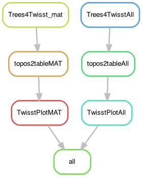

# LichenTwisst: Trying to guess the origin of the homeologs within the triploid *L. lupina* metagenome

In this pipeline I attempt to phase the triploid *L. lupina* metagenome using the pure-cultre *L. lupina* genome as reference. The idea is to take the alternative allele along the genome and make little SNP windows. Inspired by the basic logic of Twisst ([Martin & Van Belleghem 2017 Genetics 206:429–438](https://www.genetics.org/content/206/1/429)) for plotting, I make little trees from the SNP windows, and classify the found topologies based on who is the sister of the lupinas. (There is no topological weighting because there is only one sequence per species, in a sense).

## Building the environment

To run the Snakemake pipeline, I constructed a [conda environment](https://docs.conda.io/projects/conda/en/latest/). I assume in the following that you have conda installed already.

This could be done:

    $ conda create -n twisst -c bioconda

    $ conda activate twisst
    $ conda install -c bioconda snakemake-minimal=5.19.2
    $ conda install -c etetoolkit ete3=3.1.2

To plot in R I use independent little environments to avoid any conflicts

    $ cat envs/plottopos.yaml
```yaml
channels:
  - bioconda
  - defaults
  - conda-forge
  # - r # Some dependencies do not work together when I set this
dependencies:
  - r-vcfr=1.10.0
  - r-cowplot=1.0.0 # it comes with ggplot2 3.1.1
  - r-tidyr=0.8.3 # included dplyr (the newer version creates conflicts)
  - r-vegan=2.5_6
  - r-plyr=1.8.6
  - r-phangorn=2.5.5
```

## The configuration file

This pipeline uses a configuration file in yaml format. In there, the paths to the data are specified, along with the names of the samples and the minimum size of the contigs used to calculate the MAF distributions.

It looks like so:

```yaml
# Data
vcffile: "../LichenPloidy/variants/Lichens-snps-miss1-100kp-noTEs.vcf" # Produced by the LichenPloidy.smk pipeline
snpsMGdf: "../LichenPloidy/results/Lichens-snps-miss1-100kp-noTEs_lupinaMG_SNPs.txt" # Produced by the LichenPloidy.smk pipeline
gffmat: "../LichenPloidy/data/MAT_lupina.sorted_Slice_46010_0.gff"

# Parameters
matctg: "NODE_87_length_133277_cov_84.8955" # Name of the contig containing the MAT locus

# Environments
renvironment: "envs/plottopos.yaml"

# Scripts
Trees4TwisstMAT: "scripts/Trees4TwisstMAT.R"
Trees4TwisstAll: "scripts/Trees4TwisstAll.R"
LethariaTwisstPlotMAT: "scripts/LethariaTwisstPlotMAT.R"
LethariaTwisstPlotAll: "scripts/LethariaTwisstPlotAll.R"

```

## Run pipeline in Uppmax (the slurm server of Uppsala University)

First, go into the folder where you put the files of this repo. To get an idea of how the pipeline looks like we can make a rulegraph.

In Mac, you need to install graphviz to run the following command. For that you can do `brew install graphviz` using Homebrew, for example. It otherwise works well in Ubuntu.

    $ snakemake --snakefile LichenTwisst.smk --configfile LichenTwisst_config.yaml --rulegraph | dot -Tpng > rulegraph.png



See if everything is ready to be ran:
    
    $ conda activate twisst
    $ snakemake --snakefile LichenTwisst.smk --configfile LichenTwisst_config.yaml -pn

Run the pipeline:

    $ screen -R LichenTwisst
    $ conda activate twisst
    $ snakemake --snakefile LichenTwisst.smk --configfile LichenTwisst_config.yaml -p --cluster "sbatch -A snicXXXX-X-XXX -p core -n {params.threads} -t {params.time} --mail-user xxxxx@xxxxxxx.xxx  --mail-type=ALL" -j 10 --keep-going --use-conda &> LichenTwisst.log &

Where `snicXXXX-X-XXX` is your Uppmax project. Change also your email.

## Results

The pipeline is actually very basic and it does the same thing for different contigs, since I wanted the plots to look slightly different. One path is for the contig containing the MAT locus. The other is for all the other (large) contigs in the `L. lupina` pure culture. The pipeline is also badly done for Snakemake in the case of the rest of the contigs because it doesn't keep track of the actual plots, but of a dummy file that gets created when everything runs smoothly. It works, tho. I just couldn't be bothered.

So the final results:

- "LupinaMG_MAF_topologies.pdf" - Figure 6 in the paper
- Many more png plots for all the other contigs, including the four I selected for Figure S15 (which I manually put together in Inkscape). Notice that I chose those contigs because they had little missing data and few tracks of loss of heterozygosity, which were not relevant to the question because they get mostly genotyped as "lupina".
